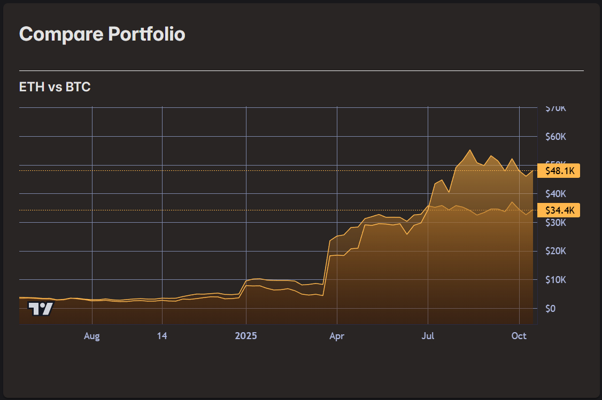
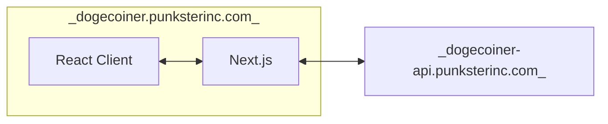
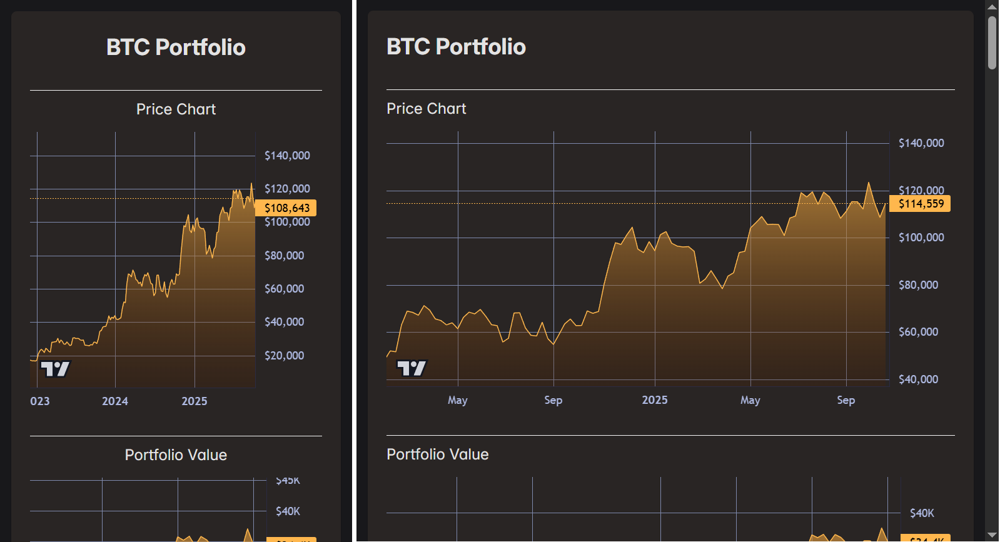
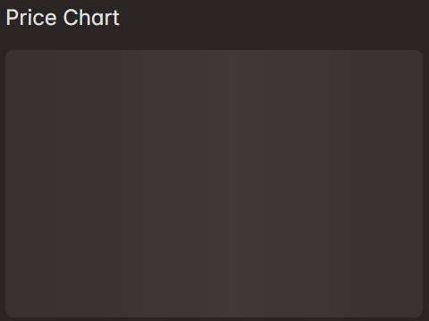
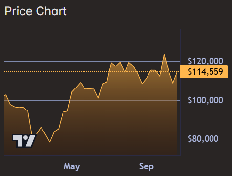
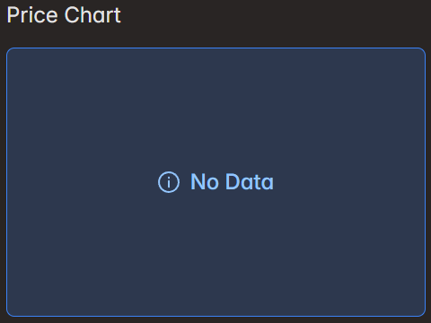
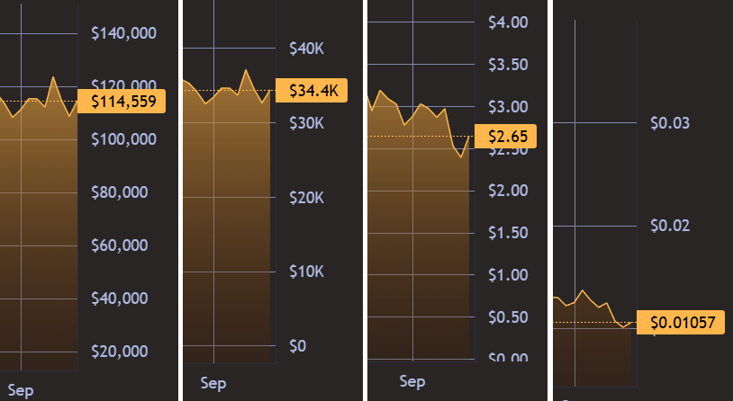

This is a [Next.js](https://nextjs.org) project bootstrapped with [`create-next-app`](https://nextjs.org/docs/app/api-reference/cli/create-next-app).

## Getting Started

First, run the development server:

```bash
npm run dev
```

Open [http://localhost:3000](http://localhost:3000) with your browser to see the result.

## Overview

This is a responsive React front end for creating and tracking portfolios.



This is also its own client/server stack using Next.js.



Next.js allows for

- improved API security 

    * the client only talks to the Next.js Node API simplifying CORS
    * the Next.js Node server securely connects to the DogeCoiner API as server to server

- smaller client payloads 
- and optimized SSR features
  
    * Next.js basically works like an Asp.Net SSR Razor web app, but with the full benefits of SPA development

Since React / Next.js is a full client/server on its own, I've opted to deploy the front end to its own subdomain.

`https://dogecoiner.punksterinc.com`

The UI allows Google login with NextAuth.js.

- users login with Google in the UI
- NextAuth generates its own JWE cookies that last 1 month
- auth cookies are proxied to the API and used as secure user sessions

## Features

The UI has these features:

Care is made to ensure the site is fully responsive across devices and form factors.


It uses the lightweight TradingView chart control for basic charting of crypto price data and simple portfolio data. This provides ability to pan, zoom, drag series, pixel perfect display and more.

Charts have multiple templates for loading: skeleton, data loaded, no data / error.





Depending on the asset, price formats need to be customized.



## Tech Design

I use:
- PrimeReact controls and tailwind for layout and styles
- Axios for API calls. (I toggle code for API connectivity, relying more on dummy data until I build out more of the UI.)